# Using Final Cut for video editing

When you have finished recording your material, you will have to edit and piece together any recordings and screen captures you have created. This can be done using the video editing software Final Cut which can be found on the Mac. 

This section will focus on how to edit a video combining both a camera recording and a screen capture. If you are editing only a camera recording, some of the following steps may be omitted. 

## Prior to opening Final Cut

Ensure you have copied across the recording from the camera which is saved in the SD card and uploaded this to the Mac. Locate your screen capture recording if you have this. 

## Setting up Final Cut

- Open Final Cut. You can find Final Cut in the dock as shown below.

```{r fcdock,echo=F, fig.align="center",out.width="100%",fig.cap="Final Cut icon"}
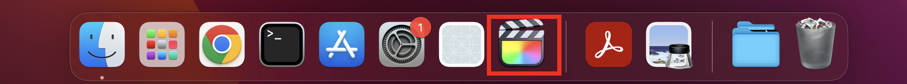
```

- When you first open Final Cut, you should see an empty display like the one below. If a library is already open, go to File > Close Library.

```{r fcmenu,echo=F, fig.align="center",out.width="100%",fig.cap="Final Cut initial display"}
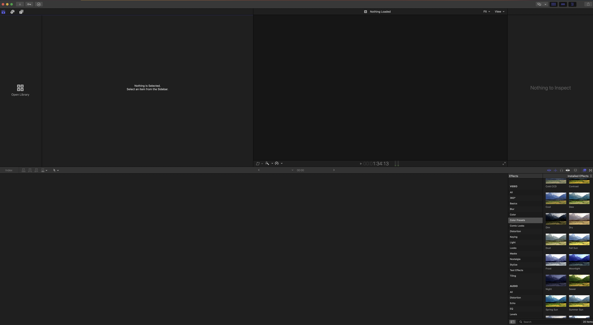
```

- Create a new library using File > New > Library. Name your library something meaningful such as “Course x”, “Week 1 – Course y”. Your library will consist of multiple events.

- Once your library has been created, an event will be automatically created with the current date, which you can see in the top left panel. You can rename this event by double clicking on the name or create a new event by right clicking on this area and selecting New Event.

```{r event,echo=F, fig.align="center",out.width="50%",fig.cap="New event created with library"}
knitr::include_graphics("Event.png")
```

- To begin editing your video, you will need to create a new project within your event. You can do this by right clicking on your event and selecting New Project. Name your project and select OK.

```{r project,echo=F, fig.align="center",out.width="50%",fig.cap="New event created with library"}
knitr::include_graphics("Project.png")
```

- Once your project is open, you can either import both your screen recording and camera capture using the Import > Media option in Files or drag and drop both files into the recording pane in the bottom half of final cut.

## Syncing your camera recording and screen capture

**NB - If you are only editing the camera recording, many of these steps can be omitted, and you will only have to change the scale and audio**

- Firstly, drag both the camera recording and screen capture onto the timeline on the bottom half of the Final Cut interface.

```{r timeline,echo=F, fig.align="center",out.width="100%",fig.cap="Final Cut timeline"}
knitr::include_graphics("FinalCutTimeline.PNG")
```

- Ensure that the screen capture video is at the top of the display and the camera recording is at the bottom on the timeline.

- Firstly, you will need to combine the screen capture and camera recording together. This can be done by heading to the top left corner of the Final Cut interface, selecting the Film icon, then selecting All in Blend Mode. 

```{r blend,echo=F, fig.align="center",out.width="60%",fig.cap="Setting Blend Mode"}
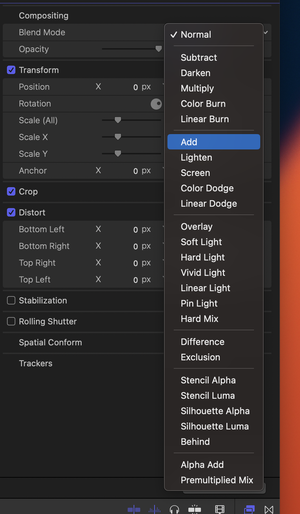
```

- Next, highlight the camera recording **only** on the timeline and change Scale x to -100%. You can enter the numbers here by double clicking. This will flip the camera recording image.

```{r scaleX,echo=F, fig.align="center",out.width="100%",fig.cap="Changing Scale x to flip video"}
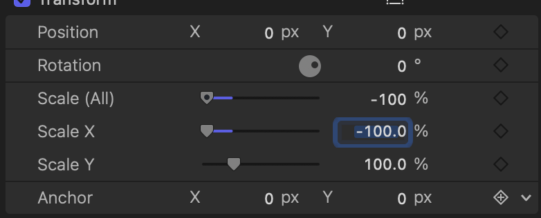
```

- With the camera recording still selected, now select the Audio menu in the top left corner (denoted by the speaker icon) and set the audio configuration to Dual Mono. 

```{r audio,echo=F, fig.align="center",out.width="100%",fig.cap="Changing audio to Dual Mono"}
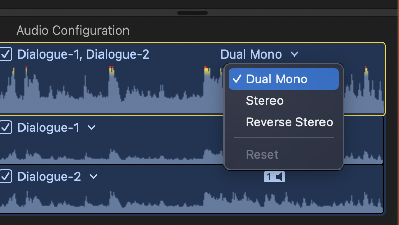
```

- Next, match up your camera output and screen capture so they are in sync. You can do this by dragging the camera output file to align with the audio of the screen capture. You can use the soundwaves underneath the videos to help matching this. You can zoom in with the editor to make this easier using Command + (and Command - to zoom out again).

- Finally, mute the sound on the screen capture video. You can do this by selecting the horizontal line on the video file in the timeline, above the sound file. Hold the left mouse button and drag down to mute. 

```{r mute,echo=F, fig.align="center",out.width="100%",fig.cap="Muting screen capture file"}
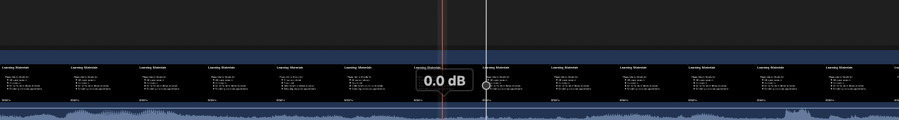
```


## Editing the video

- You may wish to add an introductory slide screen prior to your video beginning (like videos produced in ODL). The easiest way to do this is to take a screenshot of such a slide in full screen mode. You can do this by using Shift > Command > 3 which will save this to the desktop. Simply drag and drop the screen capture to your recording pane on Final Cut or use the Import command. 

- To transition between recordings, there is an option to include transitions. The most common type to use is “Blurs” and then “Simple”, though do feel free to use any transitions you wish! Simply select and drag your chosen transition and place this between two video files for the transition to be included. You can alter the length of the transition by highlighting the edges of the transition window and dragging to increase/decrease the length.  You can also add a transition using the hotkey shortcut Command + T

```{r transition,echo=F, fig.align="center",out.width="60%",fig.cap="Selecting transitions menu"}

```

```{r toptions,echo=F, fig.align="center",out.width="100%",fig.cap="Transition options"}
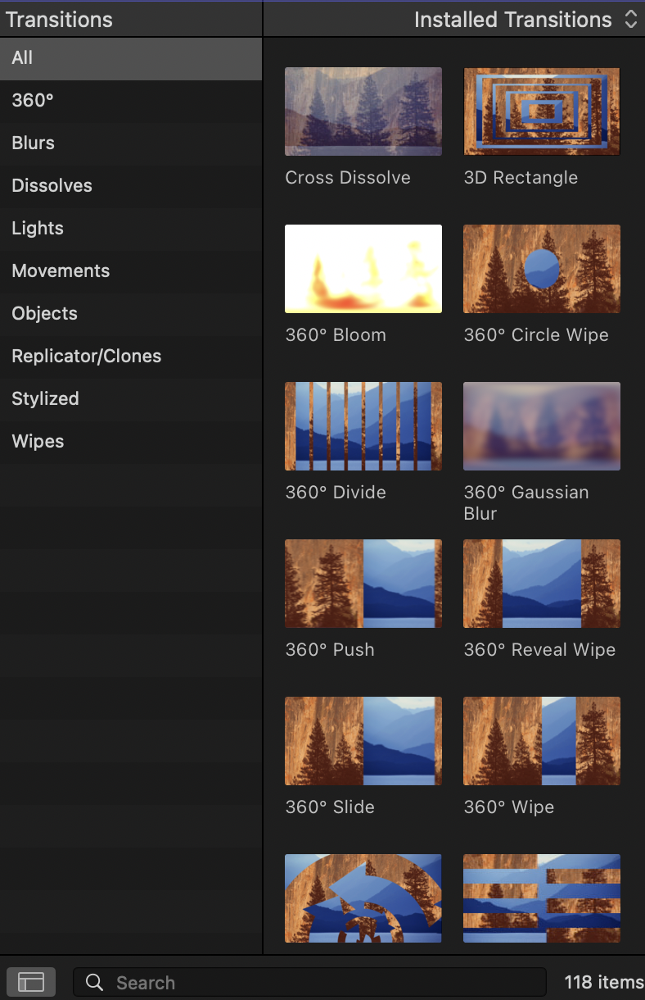
```

```{r tdrag,echo=F, fig.align="center",out.width="100%",fig.cap="Controlling the time length of a transition"}
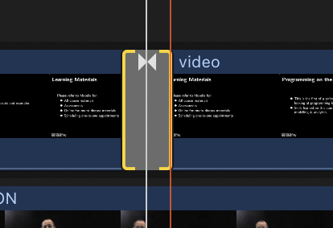
```

- You can adjust the position and size of the speaker in your camera recording by highlighting the camera recording track and selecting the bottom left panel on the recording viewer. This will allow you to select the recording in the viewer and change the size and scale much like an image in Word. You can also crop, distort and transform using the other options. 

```{r transform,echo=F, fig.align="center",out.width="100%",fig.cap="Transforming camera image size and position options"}
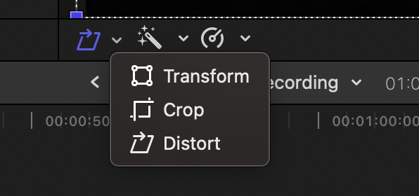
```

- You can also mask out any potential issues in your recording, for example smudges on the light board, heavily lit areas or exposed furniture by using the Effects panel. From here, you can select Masks and select from the options by double clicking your choice. This will open a new pane on the top right for you to alter the Mask to your liking. 

```{r effects,echo=F, fig.align="center",out.width="60%",fig.cap="Selecting effects option"}
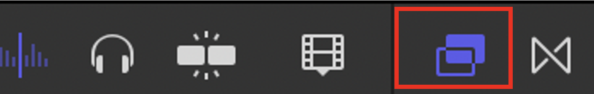
```

```{r eoptions,echo=F, fig.align="center",out.width="100%",fig.cap="Effects options for masking"}
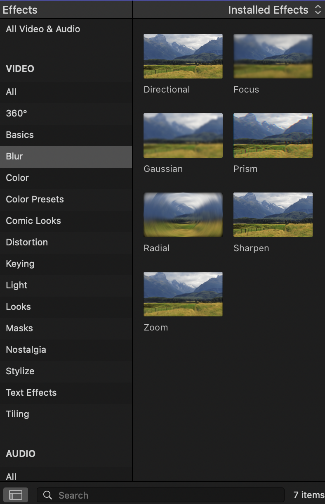
```

```{r emenu,echo=F, fig.align="center",out.width="100%",fig.cap="Menu to control aspects of masking"}
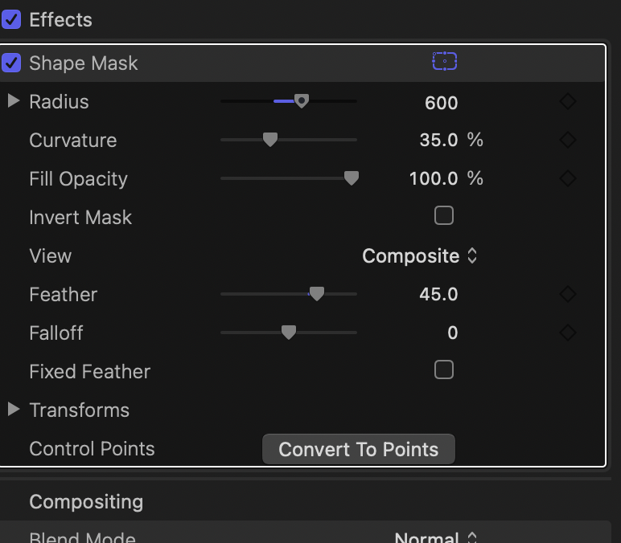
```

## Hot Keys

When editing your video, you may find the following hot key options useful when editing on the timeline. You can select all of these options in the standard menu though if you wish.

- Command +, Command - - Zoom in/out through time in timeline

- Command Z - Undo previous command 

- Command T - Add transition

- Control D - Controls the duration of the current selection (good for editing transitions and slide captures)

- H - Hand tool (this is used to  scroll through timeline)

- P - Position tool (this is used to place clips precisely)

- A - Arrow tool for selection

- B - Blade tool. This is used to crop sections of a recording. Select section of a recording where you wish to cut. You can then remove this section by pressing delete. 

## Saving your recording.

- Once you have finished editing your recording, you can save your final version by going to File > Share > Export file. 

- A menu will appear like the one shown before. You can change the video codec here to the file output you desire. The most common format to use is H264. 

```{r saving,echo=F, fig.align="center",out.width="100%",fig.cap="Exporting your video and setting format"}
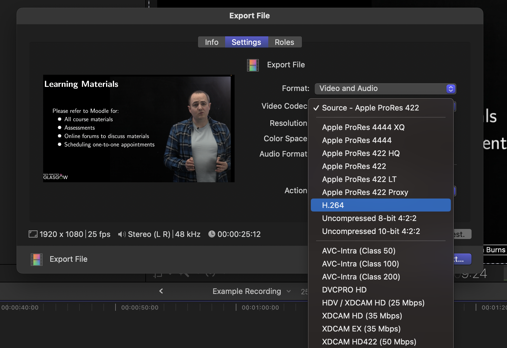
```

- **ODL only** You can export your video to YouTube to the ODL channel for sharing by selecting File > Share > YouTube. Put settings to HD1080p with privacy unlisted. Final cut will then export your video to the ODL YouTube channel UofG_AnalyticsMSc. Once this is completed, a dialogue box will appear at the top right of Final Cut. 
