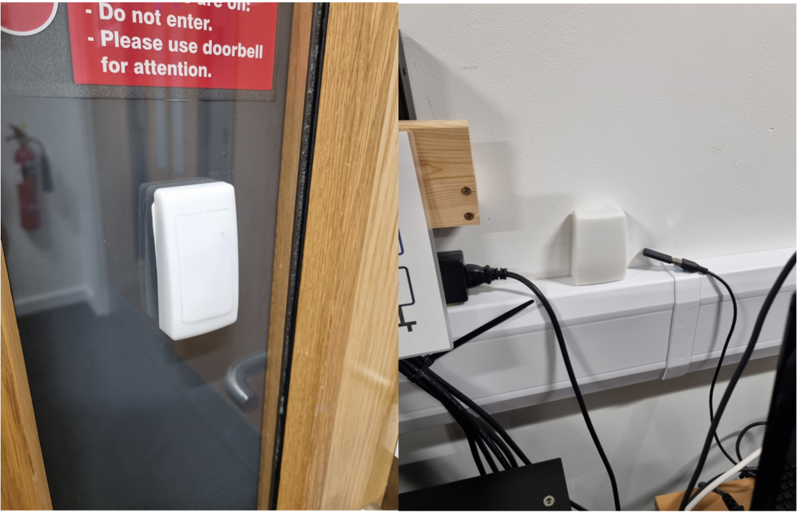

--- 
title: "BOLD Room Instructions"
author: ""
site: bookdown::bookdown_site
output:
  bookdown::gitbook:
    lib_dir: assets
    split_by: section
    config:
      toolbar:
        position: static
documentclass: book
bibliography: [book.bib, packages.bib]
biblio-style: apalike
link-citations: yes
github-repo: rstudio/bookdown-demo
---

# Introduction
This guide is designed to provide detailed instructions on how to use the BOLD room for video recordings of lecture material and tutorial videos. The guide contains three main sets of instructions:

- Setting up recording of lecture videos
- Editing videos using Final Cut
- Creating tutorial videos using the Wacom tablet

If you experience any issues using the equipment, please let us know at maths-stats-analyticsmsc-management\@glasgow.ac.uk. 


## Book a time slot
Prior to your recording, you should ensure you have booked a time slot to use the BOLD room. When booking your time slot, be sure to consider setup time and any editing time of your video when planning how much time to book. 

You can book a timeslot using the BOLD room calendar on the Maths & Stats sharepoint page [here](https://gla.sharepoint.com/sites/school-maths-stats/Lists/BOLD%20Room/calendar.aspx). 

## Accessing the BOLD room
In order to access the BOLD room, you will require SALTO access with your staff card. You will have to request access to the room from IT in order for your card to work. 

## Initial room setup

- The BOLD room can get rather cold in the winter months and the air conditioning does not switch on automatically. You may want to head down an hour or two prior to recording to switch this on.

- Switch on the LED lights for the no entry sign at the door to notify people not to access as recording is taking place. The switch for these is behind the door as you enter.

```{r door,echo=F, fig.align="center",out.width="100%",fig.cap="No-entry LED lights on door"}
knitr::include_graphics("Door_entrance.png")
```

- There is also a doorbell if someone needs to get your attention. The doorbell is set on silent but will glow to notify you that someone is at the door. The doorbell is located beside the HDMI matrix switch.

```{r buzzer,echo=F, fig.align="center",out.width="100%",fig.cap="Doorbell buzzer and location in BOLD room"}

```
